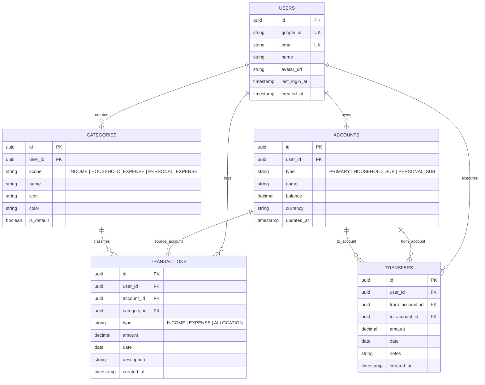

# Database Schema & ERD Specification

Spesifikasi skema basis data PostgreSQL / MySQL untuk **Aplikasi Pencatatan Keuangan Personal & Rumah Tangga Modern** dengan sistem pengelolaan multi-saldo dan autentikasi Google OAuth 2.0.

---

## 1. Entity Relationship Diagram (ERD)



---

## 2. Table Schemas & Data DDL (PostgreSQL)

### 2.1 Table `users` (Google Account Authenticated)
| Column | Type | Constraints | Description |
|---|---|---|---|
| `id` | UUID | PRIMARY KEY, DEFAULT `gen_random_uuid()` | Unique user identifier |
| `google_id` | VARCHAR(255) | UNIQUE | Google OAuth `sub` ID |
| `email` | VARCHAR(255) | UNIQUE, NOT NULL | Google Account Email |
| `name` | VARCHAR(150) | NOT NULL | Display name from Google Profile |
| `avatar_url` | TEXT | | Google Profile Picture URL |
| `last_login_at` | TIMESTAMPTZ | DEFAULT `CURRENT_TIMESTAMP` | Last authentication timestamp |
| `created_at` | TIMESTAMPTZ | DEFAULT `CURRENT_TIMESTAMP` | Account creation timestamp |

```sql
CREATE TABLE users (
    id UUID PRIMARY KEY DEFAULT gen_random_uuid(),
    google_id VARCHAR(255) UNIQUE,
    email VARCHAR(255) UNIQUE NOT NULL,
    name VARCHAR(150) NOT NULL,
    avatar_url TEXT,
    last_login_at TIMESTAMPTZ DEFAULT CURRENT_TIMESTAMP,
    created_at TIMESTAMPTZ DEFAULT CURRENT_TIMESTAMP
);
```
